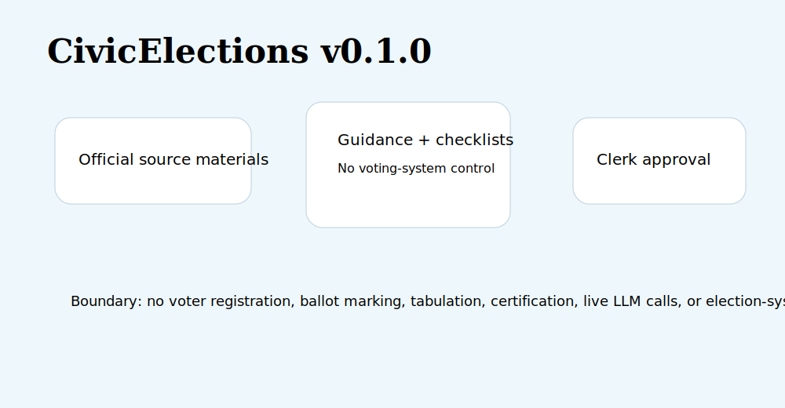

# CivicElections User Manual

For staff: use CivicElections to prepare cited voter guidance, candidate filing checklists, worker training answers, ballot-summary drafts, campaign-finance summaries, canvass checklists, and accessibility reviews. Election officials approve all public text, dates, ballot materials, canvass materials, and official decisions.

For IT: install with `python -m pip install -e ".[dev]"` and run with `python -m uvicorn civicelections.main:app --host 127.0.0.1 --port 8141`. Depends on `civiccore==0.2.0`.

